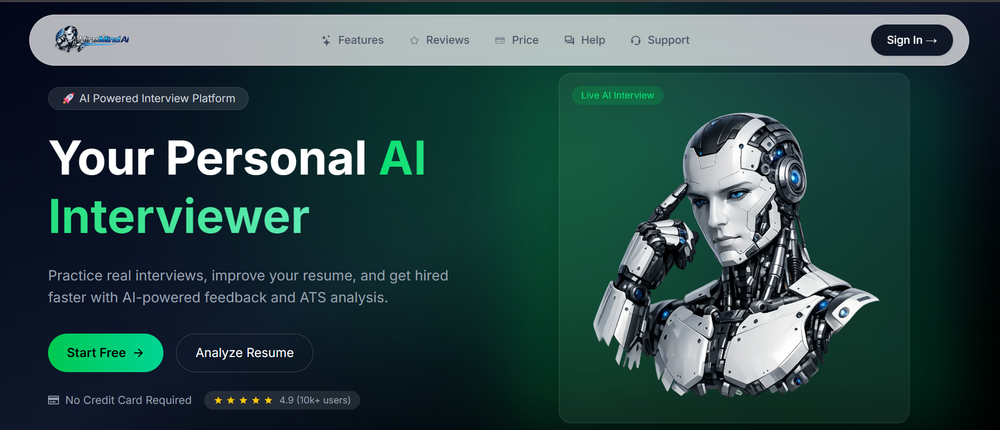
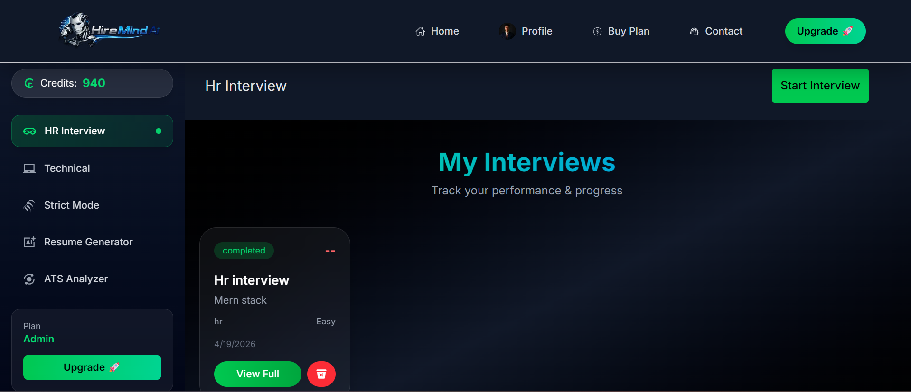
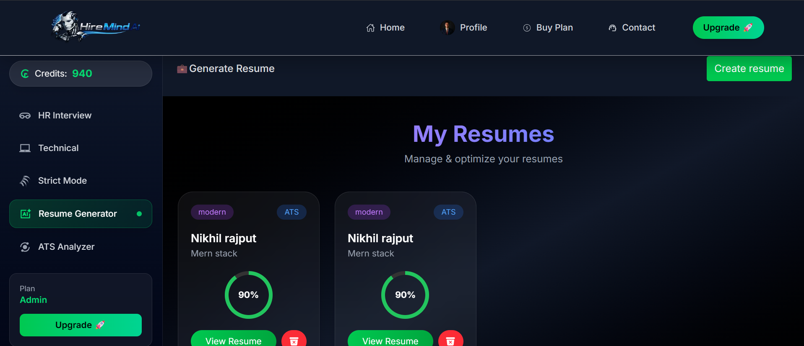
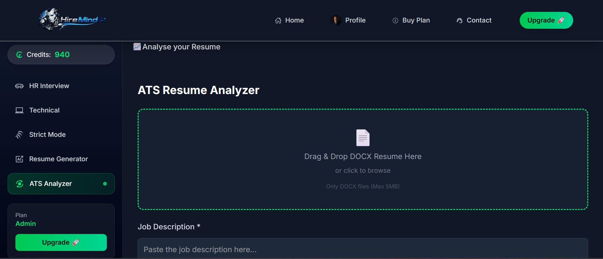

# 🚀 HireMind AI

> An AI-powered platform to help you crack interviews, build resumes, and boost your chances of getting hired.

---

## 🌟 Overview

HireMind AI is an all-in-one career preparation platform designed for students and job seekers.  
It leverages Artificial Intelligence to simulate real interviews, analyze resumes, and generate professional CVs — all in one place.

---

## ✨ Features

- 🎤 **AI Interview Practice**
  - Real-time mock interviews
  - Voice-based interaction
  - Instant feedback & performance analysis

- 📄 **Resume Generator**
  - Create ATS-friendly resumes
  - Clean & professional templates
  - Easy customization

- 📊 **Resume Analyzer**
  - Resume scoring system
  - Keyword & formatting suggestions
  - ATS optimization tips

- ⚡ **Fast Speech Recognition**
  - Real-time voice input
  - Accurate transcription
  - Smooth user experience

---

## 🛠️ Tech Stack

### Frontend

- ⚛️ React.js / Next.js
- 🎨 Tailwind CSS
- 🎞️ Framer Motion
- 🎠 Swiper.js

### Backend

- 🟢 Node.js
- 🚀 Express.js

### Database

- 🍃 MongoDB

### Other Tools

- 🔐 JWT Authentication
- ☁️ Vercel Deployment

---

## 📸 Screenshots

- Homepage
  
- AI Interview
  
- Resume Generator
  
- Resume Analyzer
  

---

## 🚀 Getting Started

### 1️⃣ Clone the repository

```bash
git clone https://github.com/Nikhil-Rajput0/hiremind-ai.git
cd hiremind-ai
```

2️⃣ Install dependencies
Bash
npm install

3️⃣ Setup environment variables
Create a .env file in root:
Environment
MONGO_URI=your_mongodb_connection
JWT_SECRET=your_secret_key

4️⃣ Run the project
Bash
npm run dev

👉 App will run on:
http://localhost:3000

📂 Folder Structure

hiremind-ai/
│── app/
│── components/
│── lib/
│── public/
│── styles/
│── package.json

🎯 Future Improvements
🤖 Advanced AI feedback system
🧠 Company-specific interview questions
📈 Performance analytics dashboard
🌐 Multi-language support
🤝

📄 License
This project is licensed under the MIT License.

👨‍💻 Author
Nikhil Kumar Singh
🌐 Portfolio: https://nikhil-next-dev.vercel.app
💼 LinkedIn: https://linkedin.com/in/nikhil-rajput-a14716275
📧 Email: nikhilrajpu236@gmail.com

⭐ Support
If you like this project, give it a ⭐ on GitHub!
💡 HireMind AI — Practice Smart, Get Hired Faster.
